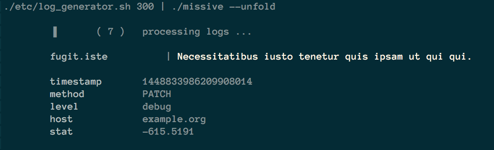

# [Unlog][releases]
[](https://circleci.com/gh/hackliff/unlog)

> Humanize your logs

__unlog__ is an experimental tool trying to improve the logging part of
application development. Currently, it expects json-formatted logs on
stdin to output something like this :

<h1 align="center">
  <br>
    
  <br>
  <br>
</h1>

## Usage

```Sh
delay=300
./etc/log_generator.sh ${delay} | \ # generate a new log line every 300 seconds
  ./unlog --unfold                  # parse and humanize output
```

## Acceptance testing / Demo

Install [phony][phony] to generate fake logs and process it through
`unlog`.

```Sh
make install.tools
make demo
```

## Deployment

```Sh
local version=0.2.0
local platform=darwin-amd64

curl \
  -ksL \
  -o /usr/local/bin/unlog \
  https://github.com/hackliff/unlog/releases/download/${version}/unlog-${platform}
chmod +x /usr/local/bin/unlog
```


## [Documentation][doc]

Check it out on [gowalker][walker], [godoc][godoc], or browse it locally:

```console
$ make godoc
$ $BROWSER docker-dev:6060/pkg/github.com/hackliff/unlog
```


## Contributing

> Fork, implement, add tests, pull request, get my everlasting thanks and a
> respectable place here [=)][jondotquote]

```console
make install.tools
go get ./...
make tests TESTARGS=-test.v
```


## Conventions

__unlog__ follows some wide-accepted guidelines

* [Semantic Versioning known as SemVer][semver]
* [Git commit messages][commit]


## Authors

| Selfie               | Name            | Twitter                     |
|----------------------|-----------------|-----------------------------|
|  | Xavier Bruhiere | [@XavierBruhiere][xbtwitter] |


## Licence

Copyright 2015 Xavier Bruhiere.

__unlog__ is available under the MIT Licence.


---------------------------------------------------------------


<p align="center">
  
</p>


[releases]: https://github.com/hackliff/unlog/releases
[semver]: http://semver.org
[commit]: https://docs.google.com/document/d/1QrDFcIiPjSLDn3EL15IJygNPiHORgU1_OOAqWjiDU5Y/edit#
[xbtwitter]: https://twitter.com/XavierBruhiere
[jondotquote]: https://github.com/jondot/groundcontrol
[walker]: http://gowalker.org/github.com/hackliff/unlog
[godoc]: http://godoc.org/github.com/hackliff/unlog
[doc]: http://hackliff.github.io/unlog/


[phony]: https://github.com/hackliff/phony
